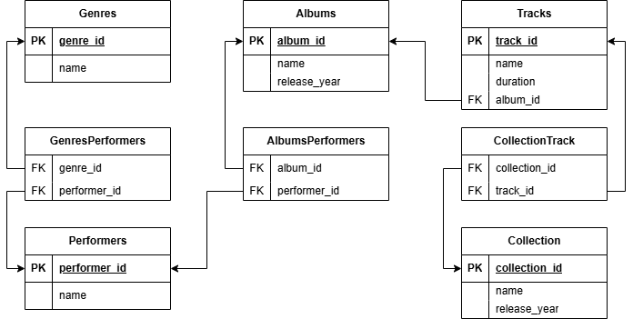

# Практическая работа по SQL

## 📋 Цель работы
1) Выполнение INSERT-запросов для заполнения базы данных тестовыми данными.
2) Выполнение SELECT-запросов для работы с музыкальной базой данных.

## 🗄️ Структура базы данных

**Основные таблицы:**
- `Performers` - исполнители
- `Genres` - музыкальные жанры  
- `PerformerGenres` - связь исполнителей и жанров
- `Albums` - музыкальные альбомы
- `AlbumsPerformers` - связь альбомов и исполнителей
- `Tracks` - треки
- `Collections` - сборники
- `CollectionTrack` - связь сборников и треков

🛠️ Технологии
- СУБД: PostgreSQL
- Язык: SQL
- Инструменты: pgAdmin 4, DBeaver